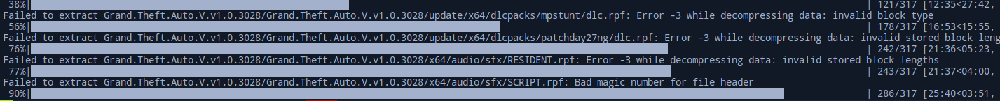

# 🗜️ ZIP Extractor with Progress Bar

This Python script extracts ZIP files and displays a progress bar. Corrupted files are skipped, and intact files are extracted.

## 📝 Features
- 🚀 Progress bar for extracting ZIP files.
- 🔒 Skips corrupted files.
- 🏷️ User-friendly input prompts.

## 🛠️ Installation

1. **Python Installation**: Ensure Python is installed on your system. You can check by running `python --version` in your terminal.
2. **Install Required Packages**: Install the necessary Python packages by running the following command:

    ```sh
    pip install tqdm
    ```

## ⚙️ Usage
1. **Run the Script**:
    ```sh
    python /path/to/your/script.py
    ```

2. **Follow the Input Prompts**:
    - Enter the path to the ZIP file.
    - Enter the output directory where the files should be extracted.

    ```sh
    Please enter path to zip-file: /path/to/your/zipfile.zip
    Please enter output-path: /path/to/extract/to
    ```

3. **Extraction**: The program will extract the ZIP file, display the progress, and skip corrupted files. After extraction is complete, a success message will be displayed.

## 📜 Example & Code



Here is the complete code of the program:

```python
import zipfile
import os
from tqdm import tqdm
import zlib

def extract_zip_excluding(input_zip, output_dir):
    try:
        with zipfile.ZipFile(input_zip, 'r') as zip_ref:
            members = zip_ref.namelist()
            total_members = len(members)
            
            # Initialize the progress bar
            with tqdm(total=total_members, unit='file') as progress_bar:
                for member in members:
                    if member:
                        try:
                            zip_ref.extract(member, output_dir)
                        except (zipfile.BadZipFile, zipfile.LargeZipFile, zlib.error) as e:
                            print(f"Failed to extract {member}: {e}")
                    progress_bar.update(1)
        return True
    except FileNotFoundError:
        print(f"The file {input_zip} does not exist.")
        return False
    except zipfile.BadZipFile:
        print(f"The file {input_zip} is not a zip file.")
        return False
    except Exception as e:
        print(f"An error occurred: {e}")
        return False

if __name__ == "__main__":
    input_zip = input("Please enter path to zip-file: ")
    output_dir = input("Please enter output-path: ")

    # Ensure the output directory exists
    if not os.path.exists(output_dir):
        os.makedirs(output_dir)

    success = extract_zip_excluding(input_zip, output_dir)
    if success:
        print("Extraction completed successfully!")
    else:
        print("Extraction failed.")
```

## ❓ Troubleshooting
- **Ensure the ZIP file is valid and not corrupted.**
- **Check the paths to the ZIP archive and the output directory.**

Feel free to ask any questions or report issues.

## 👍 Good Luck!
